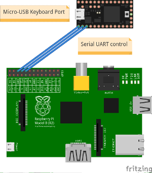

Etherkey
========
Emulate a conventional USB keyboard with a scriptable network capable microcontroller.

By using dedicated hardware it is possible to control systems even before the operating system is booted and without being dependent on the running software. For example this allows automatic bootloder selectios or modification of BIOS settings.

Requirements
------------
* [Teensy 3](https://www.pjrc.com/teensy/index.html),
* One of the following:
  * a) USB-to-UART Adapter, [for example](http://www.adafruit.com/product/954)
  * b) [Raspberry PI](http://www.raspberrypi.org/)

Setup
-------
* Flash the Teensy with the sketch in the etherkey folder. (Using [Teensyduino](https://www.pjrc.com/teensy/teensyduino.html))
* Connect the Teensy's USB-Port to the System you want to control.

### a) Direct connection to Teensy
You may connect directly to the Teensy, using a USB-to-UART Adapter.

Connect Ground to Teensy's GND-Pin, TX to Pin 0, RX to Pin 1.

Now you can use any tool you like to connect to the Teensy. Baudrate is 57600, device most likely `/dev/ttyUSB0` on Linux/UNIX. For example: `cu -l /dev/ttyUSB0 -s 57600`

### b) Using a Raspberry PI for Network features
Example setup with a Raspberry PI for the ethernet connection.

Connect GND of the Raspberry to Teensy's GND-Pin, TX to Pin 0, RX to Pin 1.

When using Raspbian as operating system, the serial port [must be configured for outgoing connections](http://elinux.org/RPi_Serial_Connection#Connection_to_a_microcontroller_or_other_peripheral).
After that a serial connection can be established with `cu -l /dev/ttyAMA0 -s 57600`

Usage and Syntax
-----

### Mode selection
`Ctrl+Q` to switch between modes.

Available modes:

* Interactive mode
* Command mode
* Debug mode

### Interactive mode
Directly sends the recieved keystroke
Supported Characters:

* All printable ASCII characters
* Arrow keys
* Backspace
* Enter
* Delete
* Tab
* Escape

### Command mode
Parses the whole line and interprets the first Word as command. Available commands:

#### SendRaw
Sends the rest of the line literally

#### Send
Sends the rest of the line while interpreting special characters.
This command behaves similarly to the send command of [AutoHotkey](http://ahkscript.org/docs/commands/Send.htm)

##### Modifiers
The following characters are treated as modifiers:

* `!`: Send the next character with the ALT key pressed.

  Example: `Send text!a` sends the keys "This is text" and then presses `ALT+a`.

* `+`: Send the next character with the SHIFT key pressed.

  Example: `Send +abC` sends the keys "AbC".

* `^`: Send the next character with the CTRL key pressed.

  Example: `Send ^c` sends a `CTRL+c` keystroke.

* `#`: Send the next character with the WIN key pressed.

  Example: `Send #d` sends a `WIN + d` keystroke.

These modifiers can be combined, so a `^+t` would send a `CTRL+SHIFT+t`, thus restoring the last tab in Firefox.

##### Keynames
Non printable characters can be sent by specifying the keyname enclosed in braces:

* `{Enter}`
* `{Escape}`
* `{Space}`
* `{Tab}`
* `{Backspace}/{BS}`
* `{Delete}/{Del}`
* `{Insert}/{Ins}`
* `{Up}`
* `{Down}`
* `{Left}`
* `{Right}`
* `{Home}`
* `{End}`
* `{PgUp}`
* `{PgDn}`

These keynames are also recognized as first word in command mode.

##### Escape sequence

To send a single character literally, it can be enclosed in braces:

* `{x}`
* `{!}`
* `{+}`
* `{^}`
* `{#}`
* `{{}`
* `{}}`

This syntax can also be used to repeat a keystroke multiple times:

Enclose the character or keyname followed by a whitespace and the number of repetitions in braces.

* For example: `{x 10}` sends the x character 10 times and `{Enter 5}` presses the Enter key 5 times.

#### Unicode characters
Arbitrary Unicode characters can be sent by specifying the 4-digit character code after the operating system specific command:

##### UnicodeLinux or UCL
Initializes the GKT+/Qt Unicode Sequence and sends the following 4-digit hexadecimal Unicode Character.

* For example: `{UCL 00F8}`

##### UnicodeWindows or UCW (experimental)
Initializes the Windows Unicode Sequence and sends the following Unicode Character. Please note: Some Windows applications require 4-digit decimal Code (e.g. Wordpad, Chrome), some other require 4-digit hexadecimal Code (e.g. Notepad++, Firefox)

You might as well need to [change a Registry Setting](http://en.wikipedia.org/wiki/Unicode_input#In_Microsoft_Windows) on your Windows machine.

* For example: `{UCW 00F8}`/`{UCW 0248}`

### Debug mode
Displays information about the received character (ASCII code, USB keycode)

Client
-----
TODO

Known issues/ Caveats
-----

### Keyboard Layouts
Due to the nature of the emulation on a USB keyboard layer, the list of
available characters is determined by the keyboard layout on the target host.

Additionally only basic ASCII characters are transmitted correctly over the
serial interface.

Thus an English keyboard layout is recommended for conventional usage. This
is also configured by default in the Teensyduino development environment, but
can be changed under "Tools" -> "Keyboard Layout".

To transmit other keys:

- Sending keys by their name in command mode
- Mixing keyboard layouts for transmission to send keystrokes defined by their position on the keyboard

  By setting the desired keyboard layout on the target system while configuring
  an English keyboard layout on the Teensy and the controlling system, it is
  possible to send keystronkes independent of the possibility to transmit the associated character.
  This works as the pressed key is interpreted on the controlling system.
